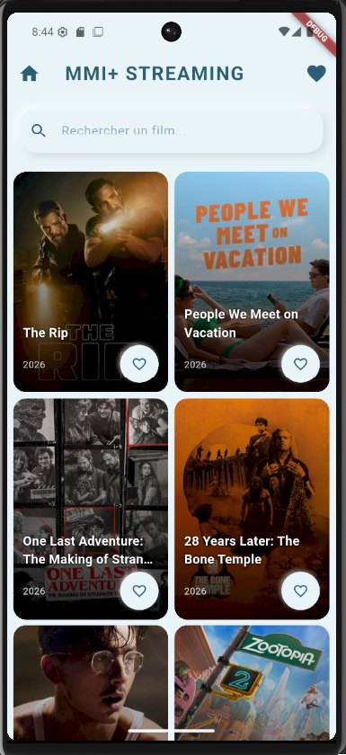
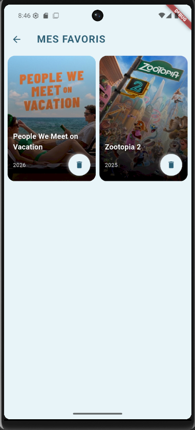
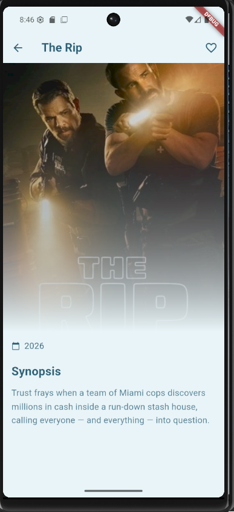
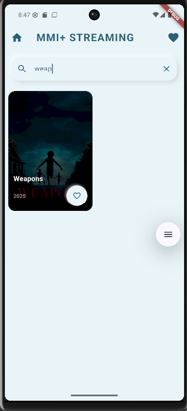

## TP4 - Plateforme de films avec API Watchmode
Pour cette application j'ai adopté un style de néomorphisme pour styliser les boutons et les cartes de films.

### 1 - Page d'accueil

### 2 - Page de favoris

### 3 - Page de détails

### 4 - Recherche de films

### Widgets/Packages à tester :
firebase_auth 
AnimatedContainer
shared_preferences